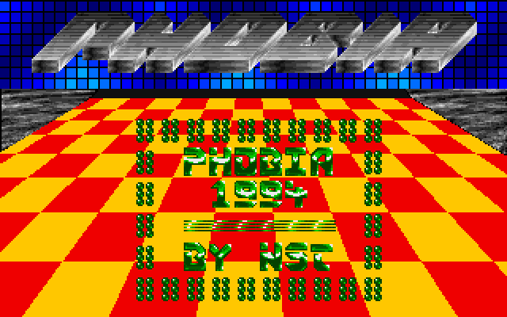

# Phobia Welcome Intro
This Pascal program is an intro demo from 1994. It displays text messages and graphics using VGA graphics mode. The program handles palette changes, writes text to the screen, and manages sound through devices like PC Speaker and SoundBlaster. The main loop updates the screen and handles user input to control the demo.

## Description
The Phobia Welcome Intro was programmed in 1994 using Turbo Pascal, with inline assembler for the graphics routines. The idea for this intro was inspired by an Amiga demo, though the specific name of the demo has been forgotten. All graphics and programming were done by Stefan Koelle on a 486 DX50 DOS PC.

This intro utilized an early version of the X-LIB unit, specifically the TextGraf.pas, which was also developed by Stefan Koelle. The source code for the intro is available on GitHub. The primary technique used in this intro to create the illusion of movement was through color palette changes, rather than altering the pixels on the screen.

The music for the intro was borrowed from an old Amiga demo and played using a public Mod-Player. The font used in the intro was custom-created and compiled into the executable as an object, along with the music and graphics.

[Phobia Website](https://www.moonweb.org/phobia/)

[YouTube Video of the Intro](https://www.youtube.com/watch?v=Cj3RgjVs5dk&t=3s)

## Requirements & Compatibility

This intro was written for **MS-DOS** in 1994 using **Turbo Pascal 7.0**. It uses
real-mode (16-bit) memory access and direct hardware port communication (VGA,
PC Speaker, SoundBlaster), so it requires either:

- A real DOS machine with VGA-compatible graphics
- An emulator such as **DOSBox**, **DOSBox-X** (recommended) or **86Box**

The program will **not** run natively on modern Windows or Linux. A 386 or
better CPU is required for the sound routines; a 486 DX50 or faster is
recommended for the intended experience.

## Directory Structure

| File              | Description                                              |
|-------------------|----------------------------------------------------------|
| `source/PHO.PAS`  | Main program source (entry point)                        |
| `source/PHO_U.PAS` | Unit linking in `PHOPIC.OBJ` & `PHOPAL.OBJ`               |
| `source/PHO_U2.PAS`| Unit linking in `PHOFNT.OBJ`                             |
| `source/TEXTGRAF.PAS` | X-LIB TextGraf unit (Stefan Koelle)                   |
| `source/COMPILE.BAT` | Original batch file used to compile the project         |
| `*.OBJ` / `*.TPU`  | Pre-compiled object/unit files for external libraries    |
| `PHO.RSC`          | Resource file containing music and graphics data         |
| `PHO.EXE`          | Pre-compiled executable (ready to run)                   |
| `images/screenshot.png` | Screenshot of the intro in action                    |

## Building from Source

If you wish to rebuild the executable from source:

1. Install **Turbo Pascal 7.0** in DOSBox (or on real hardware).
2. Place all files from `source/` in a single directory on the DOSBox drive.
3. Run `COMPILE.BAT` from within that directory.

> The `.OBJ` and `.TPU` files are pre-compiled external libraries that cannot be
> rebuilt from the original Pascal sources. The `PHO.EXE` binary in the repository
> root is ready to run and does not require compilation.

## Running the Intro

1. In DOSBox, mount the repository root as a drive (e.g. `Z:`).
2. Run `PHO.EXE`.
3. Select a sound device when prompted:
   - **F1–F2**: PC Speaker (various frequencies)
   - **F3–F4**: SoundBlaster
   - **F5–F6**: Parallel port DAC
   - **F7–F8**: Disney / Covox
   - **F9–F10**: Auto-detected
   - **ESC**: No sound
   - **`+`**: Skip the intro

## Credits & Sources

- **Coding & Graphics**: Stefan Koelle (NST / Phobia) — 1994
- **Font**: Custom-created by Stefan Koelle
- **Music**: Borrowed from an Amiga demo, played via a **public MOD-Player**
  (`MOD-Obj.OBJ`). Specific composer/demo name is unknown.
- **X-LIB / TextGraf**: Early version also developed by Stefan Koelle
- **Inspiration**: Amiga demo scene (demo title lost to time)

## Troubleshooting

| Problem                              | Solution                                  |
|--------------------------------------|-------------------------------------------|
| No sound                              | Try a different device or run under DOSBox-X with a configured SoundBlaster |
| Palette glitches / wrong colors       | Ensure emulation is in 256-color VGA mode ($13) |
| Keyboard input not responding         | Restart DOSBox-X, ensure keyboard mapping is correct |
| `PHO.RSC` not found at runtime        | Run the program from the repository root so the resource file is in the CWD |
| Compile errors                        | Use the pre-built `PHO.EXE`; the `.OBJ`/`.TPU` files are from TP 7.0 and may not link with other Pascal distributions |

## Methods in the Turbo Pascal Code

### External Procedures
These procedures are linked from an external object file (`MOD-obj.OBJ`).

1. **modvolume(v1, v2, v3, v4: integer)**
   - Adjusts the volume while playing.

2. **moddevice(var device: integer)**
   - Sets the device for sound output.

3. **modsetup(var status: integer; device, mixspeed, pro, loop: integer; var str: string)**
   - Sets up the MOD player with the given parameters.

4. **modstop**
   - Stops the MOD player.

5. **modinit**
   - Initializes the MOD player.

### Internal Procedures

1. **ch_pal**
   - Changes the palette colors in a cyclic manner to create visual effects.

2. **writeline(wly: integer; wls: string)**
   - Writes a line of text to the screen at the specified vertical position (`wly`).

3. **writeback(wly: integer; wls: string)**
   - Restores the background behind the text at the specified vertical position (`wly`).

4. **CLI**
   - Disables interrupts (inline assembly).

5. **STI**
   - Enables interrupts (inline assembly).

## Main Program Logic
The main program initializes the MOD player, sets up the graphics mode, and displays text and visual effects in a loop until a key is pressed.

### Key Features:
- **Graphics Mode Initialization**: Sets the graphics mode to 320x200 with 256 colors.
- **Palette Cycling**: Creates visual effects by cycling through palette colors.
- **Text Display**: Writes and restores text on the screen.
- **Sound Setup**: Configures and plays sound using different devices and frequencies.
- **User Interaction**: Responds to key presses to control the program flow and sound settings.

## Lizenz

Lizenziert unter der [MIT License](LICENSE) - Copyright (c) 2026 Stefan Koelle (https://stefankoelle.de)
